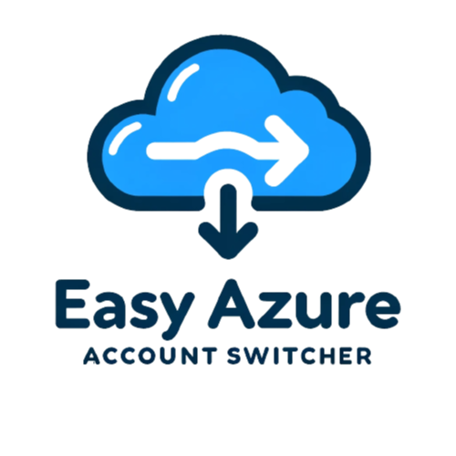
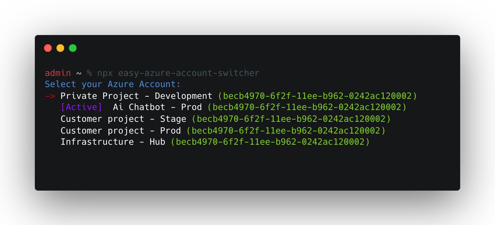

# The Easy Azure Account Switcher



This program solves a somewhat annoying problem: Switching between multiple Azure accounts.

Normally you have to copy and past the account id you want to switch to into the Azure CLI.

***Not anymore!***

With our little program you can switch between multiple accounts with just a few buttons presses.



## Requirements

- You need npm on your machine -> install here: https://docs.npmjs.com/downloading-and-installing-node-js-and-npm
- And of course you need the azure cli -> install here: https://learn.microsoft.com/en-us/cli/azure/install-azure-cli

## Usage

Just run this code in your terminal:

```
npx easy-azure-account-switcher
 ```

### Use in your own project

If you want to use the account switching in your own project, just install it as a dependency:

```
npm i easy-azure-account-switcher
```

After that you can use it like this:

```javascript
const {createSwitchAccountPrompt} = require('easy-azure-account-switcher')

await createSwitchAccountPrompt()
```

## Use Cases

- You have multiple Azure accounts and want to switch between them quickly
- No stress during the account id copy and past process
- Multiple azure cli calls are bundled for you in a beautiful cli interface

## Bugs and Feature Requests

If you find a bug or have a feature request, please create an
issue [here](https://github.com/TimonBerlin/The-Easy-Azure-Account-Switchter/issues).
